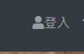
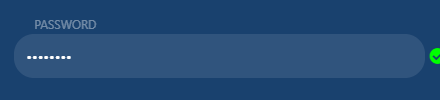

const {
        By,
        Key,
        until
    } = require('selenium-webdriver')

let config = {
    "btnLogin": {
        "byCss": "[data-testid='btnLogin']",
        "imgName": "btnLogin.png"
    },
    "iptSignInEmail": {
        "byCss": "[data-testid='iptSignInEmail']",
        "imgName": "iptSignInEmail.png"
    },
    "iptSignInPassword": {
        "byCss": "[data-testid='iptSignInPassword']",
        "imgName": "iptSignInPassword.png"
    },
    "ckboxKeepSignin": {
        "byCss": "[data-testid='ckboxKeepSignin']",
        "imgName": "ckboxKeepSignin.png"
    },
    "btnEmailSignin": {
        "byCss": "[data-testid='btnEmailSignin']",
        "imgName": "btnEmailSignin.png"
    },
    "btnGoogleSignin": {
        "byCss": "[data-testid='btnGoogleSignin']",
        "imgName": "btnGoogleSignin.png"
    },
    "spanDisplayEmail": {
        "byCss": "[data-testid='spanDisplayEmail']",
        "imgName": "spanDisplayEmail.png"
    }
}
module.exports.config = config;
module.exports = Object.assign(module.exports, {
    // REVIEW btnLogin
    //
    btnLogin:By.css("[data-testid='btnLogin']"),
    //
    // REVIEW iptSignInEmail
    //
    iptSignInEmail:By.css("[data-testid='iptSignInEmail']"),
    //
    // REVIEW iptSignInPassword
    //
    iptSignInPassword:By.css("[data-testid='iptSignInPassword']"),
    //
    // REVIEW ckboxKeepSignin
    //
    ckboxKeepSignin:By.css("[data-testid='ckboxKeepSignin']"),
    //
    // REVIEW btnEmailSignin
    //
    btnEmailSignin:By.css("[data-testid='btnEmailSignin']"),
    //
    // REVIEW btnGoogleSignin
    //
    btnGoogleSignin:By.css("[data-testid='btnGoogleSignin']"),
    //
    // REVIEW spanDisplayEmail
    //
    spanDisplayEmail:By.css("[data-testid='spanDisplayEmail']"),
    //
})