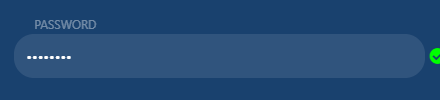

const {
        By,
        Key,
        until
    } = require('selenium-webdriver')
module.exports = {
    // REVIEW btnCloseModal
    //
    btnCloseModal:By.css("[data-testid='btnCloseModal']"),
    //
    // REVIEW iptSignInEmail
    //
    iptSignInEmail:By.css("[data-testid='iptSignInEmail']"),
    //
    // REVIEW iptSignInPassword
    //
    iptSignInPassword:By.css("[data-testid='iptSignInPassword']"),
    //
    // REVIEW ckboxKeepSignin
    //
    ckboxKeepSignin:By.css("[data-testid='ckboxKeepSignin']"),
    //
    // REVIEW btnRegisterEmail
    //
    btnRegisterEmail:By.css("[data-testid='btnRegisterEmail']"),
    //
    // REVIEW btnForgetPassword
    //
    btnForgetPassword:By.css("[data-testid='btnForgetPassword']"),
    //
    // REVIEW btnEmailSignin
    //
    btnEmailSignin:By.css("[data-testid='btnEmailSignin']"),
    //
    // REVIEW btnGoogleSignin
    //
    btnGoogleSignin:By.css("[data-testid='btnGoogleSignin']"),
    //
    // REVIEW iptRegisterEmail
    //
    iptRegisterEmail:By.css("[data-testid='iptRegisterEmail']"),
    //
    // REVIEW iptRegisterPWD1
    //
    iptRegisterPWD1:By.css("[data-testid='iptRegisterPWD1']"),
    //
    // REVIEW iptRegisterPWD2
    //
    iptRegisterPWD2:By.css("[data-testid='iptRegisterPWD2']"),
    //
    // REVIEW btnSendRegister
    //
    btnSendRegister:By.css("[data-testid='btnSendRegister']"),
    //
    // REVIEW iptResentPwdEmail
    //
    iptResentPwdEmail:By.css("[data-testid='iptResentPwdEmail']"),
    //
    // REVIEW btnResentPassword
    //
    btnResentPassword:By.css("[data-testid='btnResentPassword']"),
    //
    // REVIEW btnSwalConfirm
    //
    btnSwalConfirm:By.css("[data-testid='btnSwalConfirm']"),
    //
}