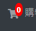

const {
        By,
        Key,
        until
    } = require('selenium-webdriver')
module.exports = {
    // REVIEW spanNumberBadge1
    //
    spanNumberBadge1:By.css("[data-testid='spanNumberBadge1']"),
    //
    // REVIEW navitemHistory
    //
    navitemHistory:By.css("[data-testid='navitemHistory']"),
    //
    // REVIEW navitemNews
    //
    navitemNews:By.css("[data-testid='navitemNews']"),
    //
    // REVIEW navitemOrderProducts
    //
    navitemOrderProducts:By.css("[data-testid='navitemOrderProducts']"),
    //
    // REVIEW navitemQandA
    //
    navitemQandA:By.css("[data-testid='navitemQandA']"),
    //
    // REVIEW navitemContactus
    //
    navitemContactus:By.css("[data-testid='navitemContactus']"),
    //
    // REVIEW btnLogin
    //
    btnLogin:By.css("[data-testid='btnLogin']"),
    //
    // REVIEW spanDisplayEmail
    //
    spanDisplayEmail:By.css("[data-testid='spanDisplayEmail']"),
    //
    // REVIEW aMyOrder
    //
    aMyOrder:By.css("[data-testid='aMyOrder']"),
    //
    // REVIEW aMyProfile
    //
    aMyProfile:By.css("[data-testid='aMyProfile']"),
    //
    // REVIEW aLogout
    //
    aLogout:By.css("[data-testid='aLogout']"),
    //
    // REVIEW spanNumberBadge2
    //
    spanNumberBadge2:By.css("[data-testid='spanNumberBadge2']"),
    //
}